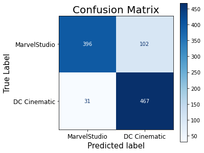
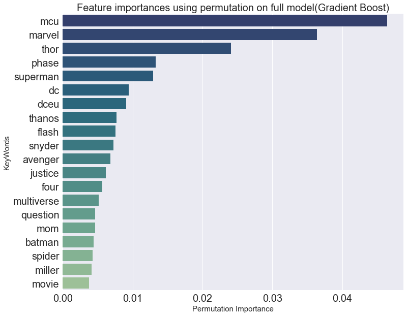

Project 3: Web APIs & NLP

 - [Problem Statement](#Problem-Statement)
 - [Background](#Background)
 - [Executive Summary](#Executive-Summary)
 - [Conclusions & Recommendations](#Conclusions-&-Recommendations)

---

### Problem Statement
In this project, we are going to study the Natural Language Processing(NLP) from basic level and how to build a robust predictive model around the preprocessed data. Our final goal is to make a prediction on dataset scrapped from 'Reddit' of which subreddit page the posts belong to.Two subreddit pages are going to be scrapped in this project, which making this a single class classification project. 
The aim of this project is to study multiple classification methods, for example: Multinomial Naive Bayes, Random Forest and etc. Every models perform differently on the given dataset and they will be evaluated and the best performer will be selected as the final models in this project.

---

### Background
The subreddit page taken for this project are:

1. ([*r/marvelstudios*](https://www.reddit.com/r/marvelstudios/))
2. ([*r/DC_Cinematic*](https://www.reddit.com/r/DC_Cinematic/))

Both subreddit are the community to discuss the content of `super hero movie` that filmed by the two company MarvelStudio from Disney Co and DC studio from Warner Bros. Both page contents genre are similar but pretty much differentiable by certain keywords or sentences which is going to be covered by analysis in the end of this project.

##### API
The *Pushshift's API* is used to scrap the data from reddit page.The pushshift.io Reddit API was designed and created by the /r/datasets mod team to help provide enhanced functionality and search capabilities for searching Reddit comments and submissions.With this API, we can quickly find the data that we are interested in and find fascinating correlations.

---

### Executive Summary
**INTRODUCTION**

This project covers three concepts Classification Modeling, Natural Language Processing and Data Wrangling/Acquisition.A **data science workflow** was implemented to conduct this analysis. Firstly, the **problem statement/project goal** was defined to classify the subreddit page base on the posts scrapped from the respective page. Next, **data cleaning** was conducted to ensure that all datatypes were accurate and any other errors were fixed.Using all data, an **exploratory data analysis(EDA)** was conducted to explore relation between the features and target variable.The following step is **Preprocessing & Feature Engineering**, NLP is used in this project since we are dealing with `text` dataset. Lastly, **Modelling and Hyperparameter Tuning** is carried out with multiple classification models and pipelining to gridsearch to identify the optimum hyperparameter for each model. 

**METHODOLOGY**

Part 1 of the project focuses on **Data wrangling/gathering/acquisition**. 
- The pushshift api to scrap the post contents from the selected subreddit page given the urls 
- Due to the limitationof 100 posts per extraction, a loop function is created to get 2000 posts for each subreddit page.

Part 2 of the project focuses on **EDA & Natural Language Processing** and converting standard text data (like Titles and Comments) into a format that allows us to analyze it and use it in modeling.
- The minimum data cleaning steps are conducted to make sure the data is consistant and comparable for both pages.
- `RegexTokenizer` is used to break the sentences into single word and `Count Vectorizer` process the data into a sparse matrix with different ngrams. From here, we can do simple EDA to identify the relation between the data and the keywords for each page.
- Before go into modelling, we remove `stopwords` and `lemmatize` our data set using the package from **Natural Language Toolkit (NLTK)**

Part 3 of the project focuses on **Classification Modeling and Hyperparameter Tuning**.
- Started with feature engineering steps as below. Each of them will be evaluated with every model and onlt the best combination will be choosen. 
   - CountVectorizer is used to transform a given text into a vector on the basis of the frequency (count) of each word that occurs in the entire text.
   - TFIDF indicates how important a specific term in a document by reduce the weight of a term if the term's occurrences are scattered throughout all the documents.
 - The evaluation is done with `RandomizedSeacrhCV` with the following models:
   1. Logistic Regression
   2. K Neighbors Classifier
   3. Decision Tree Classifier
   4. Support Vector Classifier
   5. Multinomial Naive Bayes Classifier
   6. Random Forest Classifier
   7. Stacking (Voting)
   8. Bagging
   9. Boosting (ADA Boost and Gradient Boost)
- After getting the good pre-processing method combination and models with good scores and generalisation, they will be further tuned to get the best overall model using `Gridsearch CV`. This searching method run larger iteration(longer runtime) but might able to get better score and close the generalistion gap. The trade off between the score and run time will be evaluate too.

Part 4 of the project focuses on **Model Evaluation**.
- For classification problem, we will evaluate the model base on multiple metrics as below:
  1. Scores (train/test data accuracy scores, F1 scores, sensitivity, precision and etc)
  2. Confusion matrix
  3. ROC curve - (AUC)
  4. Feature importance (will only evaluate on the best performance model - Gradient BOOSTING)
- The evaluation of model usually highly depending on business need.But since we only want to predict the subreddit page base on the dataset, the accuracy score and ROC-AUC score is good enough to define the performance of the model. Last but no least, the generalisation of model is a very important metric to evaluate the robustness of our model in making prediction on 'unseen' data.
---
### Conclusions-&-Recommendations
We have set `r/MarvelCinematic` as class '0' and `r/DC_Cinematic` as class '1'. 
The 3 best models are:
|Model|Train Accuracy|Test Accuracy|Generalization Gap|Test data ROC AUC|Test data F1 score(for class 1)|
|---|---|---|---|---|---|
|Gradient Boosting|0.90|0.87|4.36%|0.95|0.88|
|Multinomial NB|0.92|0.86|7.4%|0.96|0.86|
|Random Forest|0.88|0.84|4.53%|0.94|0.83|

In this project, the Gradient Boosting model is the best to predict the subreddit page (MarvelStudio and DC Cinematic) with ROC-AUC of 0.95. The class 0 (Marvel Studio) F1 score is 0.86 and class 1 (DC Cinematic) F1 score is 0.88 with good generalisation of 4.36%!

The best 20 features(words) that making up the contribution to predict the subreddit page are identify using the `permutation feature importance` method as below:

The NLP & classification modelling can be improved through hyperparameter tuning (RandomizedSearchCV and GridSearchCV), we must weight the trade off between the target performance and computation time. The ROC curve plot is very easy to visualize the performance of each model in doing correct prediction. The mothod of using randomizedsearchCV to narrow down the hyperparameter range followed by full gridsearchCV able to save whole computing time by enourmous amount (1112% shorter run time for Gradient boost model).

In conclusion, all the 3 models are having their own pros and cons:

1. Multinimial NB - Very fast computing speed with best train score and AUC, but less hyperparameter to tune and hard to close the generalisation gap

2. Random Forest - Has the lowest generalisation score from GridSearch, but having lower score and longest compiting time

3. Gradient Boosting - So far the best model, wide variaty of hyperparameter to tune, moderate computing time, able to achieve good score and generalisation gap

**Limitation**

- This model only can use for this two subreddit pages
- The date of the scrapped data is very critical because the posts and discussions are very cyclical especially during any of the movie is released.
- Minimum data cleaning was performed due to big chunk of the data consist of image/video which labelled as 'NA' when scrapped by pushshift.api.

